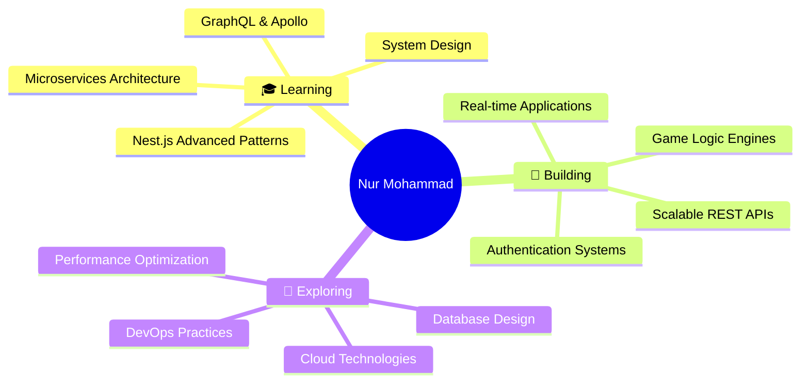

<div align="center">
  
  <!-- Animated Wave Banner -->
  
  
  <!-- Animated Greeting -->
  
  
  <br/>
  
  <!-- Social Badges with Glow Effect -->
  <a href="https://bd.linkedin.com/in/nurmohammad56">
    
  </a>
  <a href="mailto:nurmohammad0605@gmail.com">
    
  </a>
  <a href="https://github.com/NurMohammad56">
    
  </a>
  
  <br/><br/>
  
  <!-- Profile Views Counter -->
  
  
</div>

<br/>

<!-- Gradient Divider -->


<br/>

##  About Me

```typescript
const nurMohammad = {
    role: "Backend Developer",
    location: "Gazipur, Dhaka, Bangladesh 🇧🇩",
    experience: "2+ Years",
    
    code: ["JavaScript", "TypeScript", "Python", "SQL"],
    technologies: {
        backend: {
            runtime: ["Node.js"],
            frameworks: ["Express.js", "Nest.js"],
            databases: ["MongoDB", "Redis", "Firebase"],
            architecture: ["REST APIs", "Microservices", "WebSockets"]
        },
        frontend: {
            js: ["React", "Next.js"],
            styling: ["Tailwind CSS", "Material-UI"]
        },
        devOps: ["Docker", "Nginx", "Linux", "Git"],
        tools: ["Postman", "Figma", "VS Code"]
    },
    
    currentFocus: "Mastering Nest.js & Microservices Architecture 🚀",
    funFact: "I debug with console.log() and I'm not ashamed! 😄",
    philosophy: "Clean code is not written by following rules. It's written by professionals with a deep sense of care."
};
```

<br/>

<!-- Gradient Divider -->


<br/>

##  Tech Stack & Tools

<div align="center">

### 🎯 Core Backend Technologies
<p>
  
</p>

### ⚡ Languages & Frameworks
<p>
  
</p>

### 🛠️ DevOps & Tools
<p>
  
</p>

</div>

<br/>

<!-- Gradient Divider -->


<br/>

## 📊 GitHub Analytics

<div align="center">
  
  <!-- GitHub Stats with Custom Theme -->
  
  
  <!-- GitHub Streak Stats -->
  

</div>

<br/>

<div align="center">
  
  <!-- Top Languages Card -->
  
  
  <!-- Trophy Stats -->
  

</div>

<br/>

<!-- Contribution Graph -->
<div align="center">
  
</div>

<br/>

<!-- Gradient Divider -->


<br/>

## 🎯 What I'm Up To

<div align="center">



</div>

<br/>

<!-- Gradient Divider -->


<br/>

## 🏆 Achievements & Highlights

<div align="center">

| 🎯 | Achievement |
|---|---|
| 💻 | **2+ Years** of professional backend development |
| 🚀 | Built **scalable systems** serving thousands of users |
| 🔐 | Architected **secure authentication** flows |
| 🎮 | Engineered **complex game logic** systems |
| ⚡ | Optimized **API performance** by 40% |
| 📚 | Mentored **junior developers** in Node.js |

</div>

<br/>

<!-- Gradient Divider -->


<br/>

## 💡 Fun Facts About Me

<div align="center">

🌙 **Night Owl Coder** - My best code is written after midnight ⏰  
☕ **Coffee Powered** - Fueled by caffeine and clean code 💪  
🎮 **Game Logic Enthusiast** - Love building complex game mechanics 🕹️  
📖 **Continuous Learner** - Always exploring new technologies 🚀  
🎨 **Design Appreciator** - Backend with an eye for frontend beauty ✨

</div>

<br/>

<!-- Gradient Divider -->


<br/>

## 📬 Let's Connect & Collaborate!

<div align="center">

<p>
  💼 Open to exciting backend opportunities and collaborations<br/>
  🤝 Always happy to help fellow developers<br/>
  📧 Reach out for project discussions or tech talks!
</p>

<br/>

<!-- Animated Contact Buttons -->
<a href="https://bd.linkedin.com/in/nurmohammad56">
  
</a>
<a href="mailto:nurmohammad0605@gmail.com">
  
</a>
<a href="https://github.com/NurMohammad56">
  
</a>

<br/><br/>

### ⭐ If you find my work interesting, feel free to star my repositories!


<!-- Quote -->
<br/>


<br/><br/>

<!-- Animated Footer -->


<!-- Snake Animation -->
<picture>
  <source media="(prefers-color-scheme: dark)" srcset="https://raw.githubusercontent.com/NurMohammad56/NurMohammad56/output/github-contribution-grid-snake-dark.svg">
  <source media="(prefers-color-scheme: light)" srcset="https://raw.githubusercontent.com/NurMohammad56/NurMohammad56/output/github-contribution-grid-snake.svg">
  
</picture>

</div>

---

<div align="center">
  
  
  
</div>
