<div align="center">
  
  <!-- Animated Wave Banner -->
  
  
  <!-- Animated Greeting -->
  
  
  <br/>
  
  <!-- Social Badges with Glow Effect -->
  <a href="https://bd.linkedin.com/in/nurmohammad56">
    
  </a>
  <a href="mailto:nurmohammad0605@gmail.com">
    
  </a>
  <a href="https://github.com/NurMohammad56">
    
  </a>
  
  <br/><br/>
  
  <!-- Profile Views Counter -->
  
  
</div>

<br/>

<!-- Gradient Divider -->


##  About Me

```typescript
const nurMohammad = {
    role: "Backend Developer",
    location: "Dhaka, Bangladesh",
    experience: "2+ Years",
    
    code: ["JavaScript", "TypeScript"],
    technologies: {
        backend: {
            runtime: ["Node.js"],
            frameworks: ["Express.js", "Nest.js"],
            databases: ["MongoDB", "Redis", "Firebase"],
            architecture: ["REST APIs", "Microservices", "WebSockets"]
        },
        frontend: {
            js: ["React"],
            styling: ["Tailwind CSS"]
        },
        devOps: ["Docker", "Nginx", "Linux", "Git"],
        tools: ["Postman", "Figma", "VS Code"]
    },
    
    currentFocus: "Learning Nest.js & Microservices Architecture",
    funFact: "I debug with console.log() and I'm not ashamed.😒",
    philosophy: "Clean code is not written by following rules. It's written by professionals with a deep sense of care."
};
```

<br/>

<!-- Gradient Divider -->


<br/>

## 📊 GitHub Analytics

<div align="center">
  
  <!-- GitHub Stats with Custom Theme -->
  
  
  <!-- GitHub Streak Stats -->
  

</div>

<br/>

<div align="center">
  
  <!-- Top Languages Card -->
  


</div>

<br/>

<!-- Contribution Graph -->
<div align="center">
  
</div>

<br/>

<!-- Gradient Divider -->


<br/>

## 🎯 What I'm Up To

```mermaid
mindmap
  root((Nur Mohammad))
    🎓 Learning
      Nest.js Advanced Patterns
      Microservices Architecture
      GraphQL & Apollo
      System Design
    💼 Building
      Scalable REST APIs
      Real-time Applications
      Authentication Systems
      Game Logic Engines
    🌟 Exploring
      Cloud Technologies
      DevOps Practices
      Performance Optimization
      Database Design
```

<div align="center">



</div>

<br/>


<!-- Gradient Divider -->


<br/>

## 📬 Let's Connect & Collaborate!

<div align="center">

<p>
  💼 Open to exciting backend opportunities and collaborations<br/>
  🤝 Always happy to help fellow developers<br/>
  📧 Reach out for project discussions or tech talks!
</p>

<br/>

<!-- Animated Contact Buttons -->
<a href="https://bd.linkedin.com/in/nurmohammad56">
  
</a>
<a href="mailto:nurmohammad0605@gmail.com">
  
</a>
<a href="https://github.com/NurMohammad56">
  
</a>

<br/><br/>


<!-- Animated Footer -->


</div>

---

<div align="center">
  
  
  
</div>
